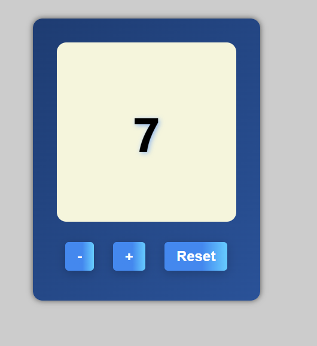

# Counter App

A simple React counter application built with TypeScript and Vite.

## Features

- Increment and decrement counter
- Reset counter to zero
- Clean and responsive UI
- Built with React and TypeScript

## Installation

1. Clone the repository
2. Install dependencies:
   ```bash
   npm install
   ```

## Usage

To run the development server:

```bash
npm run dev
```


## Screenshot




## Technologies Used

- React
- TypeScript
- Vite
- CSS 